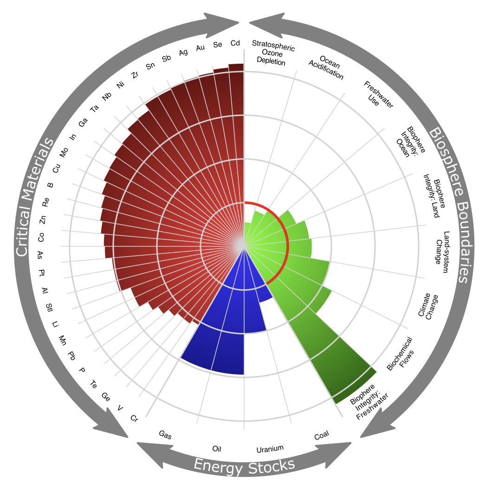
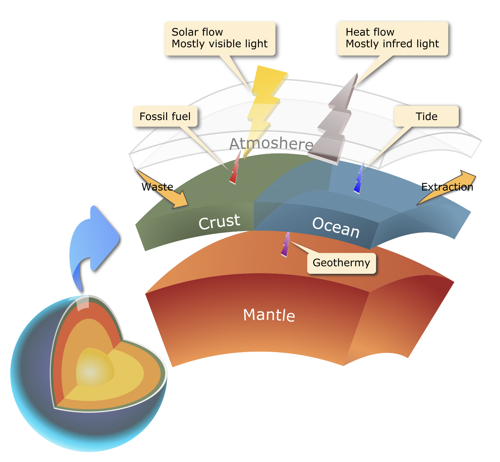

# Extending Planetary Boundaries with Nonrenewable Energies and Critical Metals Boundaries

This research project is about creating an enhanced Planetary Boundaries with detailed information of nonrenewable energy stocks and critical metal consumptions.  
The main doc link for research collaboration is [here](https://docs.google.com/spreadsheets/d/1BQxb_64Y3AaJucbi4gKFQSzHyF9mcKbcQFAaD9j6oKM/edit?usp=sharing) which was used for discussion with Professor Thomas Gregor and sharing the data discovered in the research.

## Abstract
Since 2009, Planetary Boundaries have provided a framework of understanding the potential of human activities causing non-linear, abrupt environment changes at the continental to planetary scale. Since its original publication, it is widely agreed that several boundaries of the global change processes were crossed including climate change, loss of biosphere integrity, land-system change, altered biogeochemical cycles. This study extends the Planetary Boundaries by identifying the imminent risks of the depletion of nonrenewable energies and critical metals through the study of their global production, consumption and reserves.  
**Key Words**: Planetary Boundaries, nonrenewable resources

## Graph Generation
The below graph was created using [Inkscape](https://inkscape.org/).   

Particularly, the radial graph of the "Enhanced Planetary Boundaries with Critical Metal and Energy Stocks" graph was first generated as a prototype with a JavaScript program using the d3 library in order to create the exact radius of each segament. Then the prototype was enhanced using Inkscape to add the double-arraws and other features.  

### Enhanced Planetary Boundaries with Critical Metal and Energy Stocks

### Global Energy Flow

